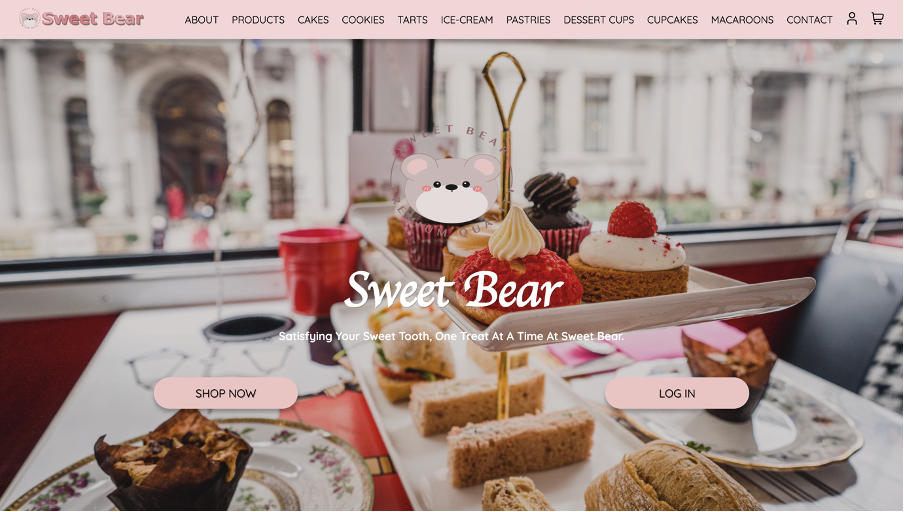
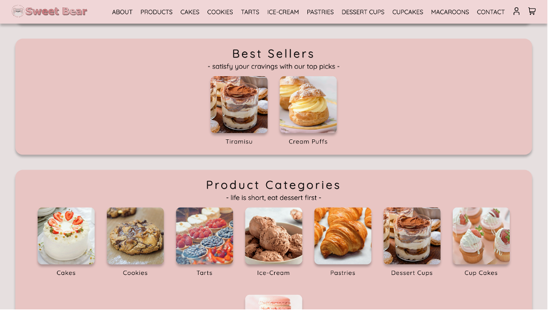
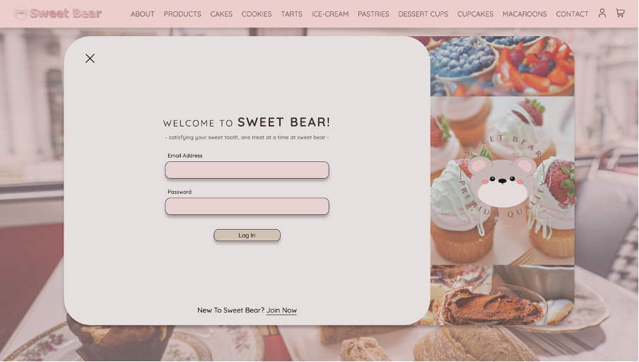
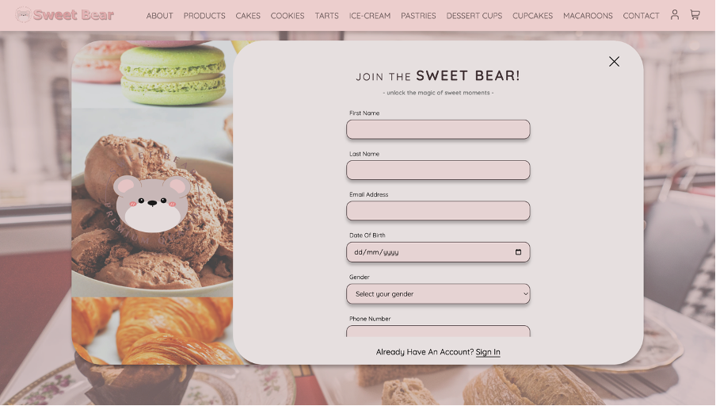
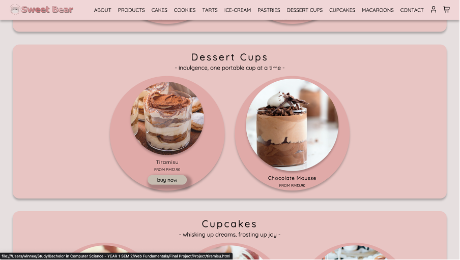
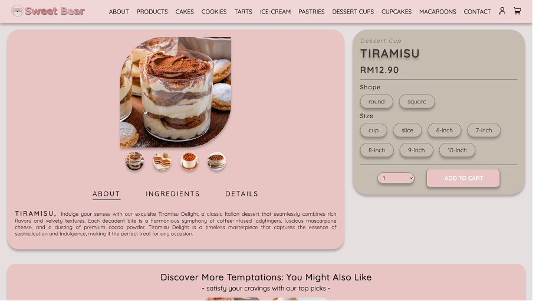
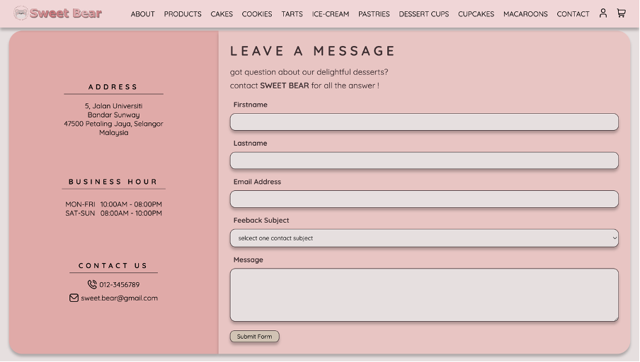

# Sweet Bear Bakery 🧸🍰

A beautiful, responsive e-commerce website for Sweet Bear Bakery, featuring an extensive collection of desserts and baked goods with modern UI/UX design.

## Program Output















## 🌟 Features

- **Responsive Design**: Mobile-first approach with adaptive layouts for all screen sizes
- **Product Catalog**: Comprehensive showcase of bakery items across multiple categories
- **Shopping Cart**: Interactive cart functionality with product management
- **User Authentication**: Login/signup system with profile management
- **Product Categories**:
  - Cakes (Black Forest, Cheesecake, Opera Cake, Red Velvet, Strawberry Cake, Tiramisu, Fruit Cake)
  - Cookies (Chocolate Chip, Oatmeal, Icing Cookies)
  - Tarts (Chocolate Tart, Fruit Tarts)
  - Ice Cream (Multiple flavors)
  - Pastries (Croissants, Cream Puffs)
  - Dessert Cups (Chocolate Mousse)
  - Cupcakes (Frosted, Fruit, Hokkaido)
  - Macaroons
- **Contact System**: Contact form with validation and business information
- **Modern UI**: Clean, pastel color scheme with smooth animations

## 🎨 Design

- **Color Palette**: Soft pastels with warm tones
- **Typography**: Quicksand font family for modern, clean appearance
- **Layout**: Grid-based responsive design
- **Interactive Elements**: Hover effects, smooth transitions, and engaging animations

## 📁 Project Structure

```
SweetBearBakery/
├── home.html                 # Landing page
├── catalogue.html            # Product catalog
├── contact.html              # Contact information and form
├── profile.html              # User profile page
├── style.css                 # Main stylesheet
├── js.js                     # JavaScript functionality
├── source/                   # Assets directory
│   ├── products/            # Product images
│   ├── *.png, *.jpg        # UI icons and images
│   └── *.svg               # Vector graphics
└── [product-pages].html     # Individual product pages
```

## 🚀 Getting Started

### Prerequisites

- A modern web browser (Chrome, Firefox, Safari, Edge)
- No additional dependencies required

### Installation

1. Clone or download the repository
2. Open `home.html` in your web browser
3. Navigate through the site using the navigation menu

### Local Development

For local development, you can use any local server:

```bash
# Using Python (if installed)
python -m http.server 8000

# Using Node.js (if installed)
npx http-server

# Using PHP (if installed)
php -S localhost:8000
```

Then visit `http://localhost:8000` in your browser.

## 🛍️ Product Categories

### Cakes

- Black Forest Cake
- Cheesecake
- Opera Cake
- Red Velvet Cake
- Strawberry Cake
- Tiramisu
- Fruit Cake

### Cookies & Pastries

- Chocolate Chip Cookies
- Oatmeal Cookies
- Icing Cookies
- Croissants
- Cream Puffs

### Tarts & Desserts

- Chocolate Tart
- Fruit Tarts
- Chocolate Mousse
- Ice Cream (Multiple flavors)

### Cupcakes & Macaroons

- Frosted Cupcakes
- Fruit Cupcakes
- Hokkaido Cupcakes
- Macaroons

## 🎯 Key Functionality

### Navigation

- Responsive navigation bar with dropdown menu for mobile
- Category-based filtering for products
- Smooth scrolling and transitions

### Shopping Experience

- Interactive product gallery
- Shopping cart with add/remove functionality
- Product detail pages with multiple images

### User Features

- Login/signup system
- User profile management
- Contact form with validation

## 📱 Responsive Design

The website is fully responsive and optimized for:

- Desktop (1200px+)
- Tablet (768px - 1199px)
- Mobile (320px - 767px)

## 🎨 Customization

### Colors

The color scheme is defined in CSS custom properties in `style.css`:

```css
:root {
  --c1: #e6dfdf;
  --c2: #f0d6d7;
  --c3: #e8c5c3;
  /* ... more color variables */
}
```

### Fonts

Uses Google Fonts (Quicksand) for consistent typography across all devices.

## 🛠️ Technologies Used

- **HTML5**: Semantic markup and structure
- **CSS3**: Modern styling with Flexbox and Grid
- **JavaScript**: Interactive functionality and DOM manipulation
- **Responsive Design**: Mobile-first approach
- **Google Fonts**: Typography

**Sweet Bear Bakery** - Where every bite is a sweet adventure! 🧸✨
